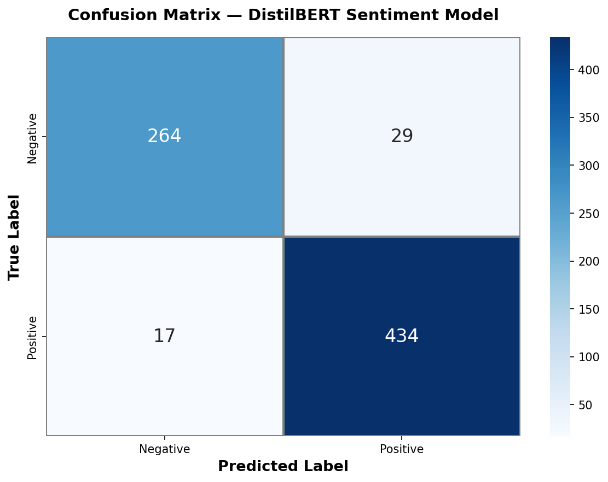

# Sentiment Analysis Model

A DistilBERT-based sentiment classification model fine-tuned on customer reviews to predict Positive or Negative sentiment. Built as an educational experiment to explore how sentiment models perform when integrated into a review analysis app.

## ⚠️ Disclaimer

This model is **not production-ready**. It was built for:

- **Educational purposes** — understanding how DistilBERT fine-tuning works on domain-specific text
- **App prototyping** — testing how a sentiment model would behave inside a [TripNest Application](https://github.com/linmyatoo/TripNest_admin) we developed

The model is trained on a small dataset (~4,450 samples) and may misclassify neutral or sarcastic reviews. Do not rely on it for critical or high-stakes use cases.

## What It Does

Takes raw customer reviews as input and classifies them as Positive or Negative with a confidence score.

```
Input:  "Terrible experience. Rude staff and long lines."

Output: Negative (confidence: 1.00)
```

```
Input:  "Amazing event! Everything was perfect!"

Output: Positive (confidence: 1.00)
```

## Architecture

| Component | Detail |
|-----------|--------|
| Base model | `distilbert-base-uncased` (66M params) |
| Task | Binary sequence classification |
| Labels | `0` = Negative, `1` = Positive |
| Max input length | 128 tokens |
| Framework | PyTorch + HuggingFace Transformers |
| Training epochs | 4 |
| Batch size | 16 |
| Learning rate | 3e-5 (cosine annealing) |
| Optimizer | AdamW (weight decay=0.01) |

## Results

Classification report on the held-out test set (10% of data, stratified split):

| Metric | Negative | Positive | Overall |
|--------|----------|----------|---------|
| Precision | 0.92 | 0.97 | — |
| Recall | 0.94 | 0.96 | — |
| F1 Score | 0.93 | 0.97 | — |
| **Accuracy** | — | — | **95%** |



> These scores reflect a controlled educational dataset and may not generalize to real-world, noisy, or domain-shifted reviews.

## Dataset

- **Source:** `combined_reviews_dataset.csv` (custom combined review dataset)
- **Total Samples:** ~4,450 (after deduplication)
- **Class Distribution:** ~2:1 (Positive : Negative)
- **Split:** 80% Train / 10% Validation / 10% Test (stratified)

## Project Structure

```
Sentiment_Analysis/
├── Sentiment_Analysis.ipynb   # Full training + evaluation notebook
├── confusion_matrix.png       # Confusion matrix visualization
└── README.md
```

## How to Run

1. Open `Sentiment_Analysis.ipynb` in Google Colab
2. Upload your dataset to Google Drive at the expected path, or update `DATA_PATH`
3. Run all cells — training takes ~2 minutes on a GPU

### Requirements

```
torch
transformers
emoji
pandas
numpy
scikit-learn
seaborn
matplotlib
```

## Limitations

1. **Binary only** — Cannot distinguish neutral reviews. Neutral statements (e.g., "It was okay") are forced into Positive or Negative.
2. **Small dataset** — Trained on ~4,450 samples. Not representative of real-world review noise, sarcasm, or multilingual text.
3. **No domain adaptation** — Performance may degrade on reviews from different domains (e.g., restaurant vs. electronics).
4. **High confidence ≠ correctness** — The model can be confidently wrong on ambiguous or sarcastic text.

## Future Improvements

- **Larger dataset** — current model is limited by ~4,450 samples
- **Three-class classification** — add a Neutral label to handle ambiguous reviews
- **Domain-specific fine-tuning** — train on domain-specific data for better generalization
- **Larger base model** — `bert-base-uncased` or `roberta-base` could improve accuracy
- **App integration** — deploy as an API endpoint for the review analysis pipeline

## License

This project is for educational and experimental use only.
